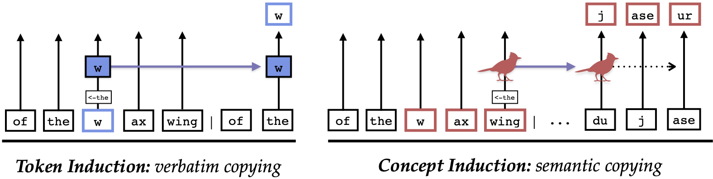

# The Dual-Route Model of Induction

*Code and data for [The Dual-Route Model of Induction](https://dualroute.baulab.info) by Feucht et al. (2025).*

How do LLMs copy meaningful text in-context? We find that in addition to token-level induction heads described in previous work, LLMs develop *concept induction heads* which are be used to copy word meanings (instead of literal tokens). See the full paper for details. 



Please contact `feucht.s[at]northeastern.edu` for any questions regarding the paper or this repository. 


## Per-Head Scores
If you do not want to run our code, we provide pre-cached scores for heads in four models. 

The folder `cache/causal_scores/[model_name]` contains saved results for causal scores from Section 2:
- `token_copying_len30_n1024.json`
- `concept_copying_len30_n1024.json`

Whereas `cache/attention_scores/[model_name]` contains results for attention-based scores from Section 3:
- `nexttok_matching_n2048.json`
- `lasttok_matching_n2048.json`

As discussed in the paper, we focus on token induction scores over random tokens and concept induction scores over CounterFact ([Meng et al., 2022](https://rome.baulab.info/)) tokens. If you would like scores for the other two possiblities (next-token scores over entity tokens, or last-token scores over random tokens), please contact us over email.

## Setup 
If you want to run any of our code, this repo requires Python 3.10+ and PyTorch 2.6.0+. We use the `nnsight` package (v0.4.3) for all intervention experiments, which itself uses HuggingFace model implementations. Set up a virtual environment using `requirements.txt`:

```bash
python3.11 -m venv .env -r requirements.txt
source .env/bin/activate
```

## Code

We provide scripts for each of the major experiments in our work. Scripts should be run from the `scripts` subdirectory. Please make sure to set up your Python installation as described above first. All scripts have been tested and run for four different models (shown in Table 1 of the main paper). 

### Section 2: Causal Scores
`scripts/causal_scores.py` calculates causal copying scores for individual heads in a given model. Scores for concepts $c$ (i.e. concept copying scores) must be calculated in a separate run from scores for random tokens $r$ (i.e. token copying scores). 
- e.g., to replicate Figure 11, you would run `python causal_scores.py --model meta-llama/Meta-Llama-3-8B`. 
- e.g., to replicate Figure 12, you would run `python causal_scores.py --model meta-llama/Meta-Llama-3-8B --random_tok_entities`

`scripts/convert_causal_scores.py` converts results from the previous script into readable json files. We used this script to generate the json files in `cache`. If you use a different `n` or sequence length, you will have to edit this script. 
- e.g. continuing with the same example, run `python convert_causal_scores.py --model_name Meta-Llama-3-8B` to convert the above results into json files. 

### Section 3: Attention Scores
`scripts/attention_scores.py` calculates attention-based scores for individual heads [TODO]

### Section 4: Ablations
`scripts/vocablist_ablation.py` runs and saves mean-ablation experiments for the top-*k* heads ranked by a particular score. To ablate, e.g., concept heads for a pre-set list of *k* values, you can run `python vocablist_ablation.py --task fr-en --head_ordering concept_copying --model allenai/OLMo-2-1124-7B`

### Section 5: Patching
`scripts/language_patching.py` patches the top-*k* heads based on some ranking from one translation prompt to another, based on work from Dumas et al. (2025). You must run this script for each individual value of *k* you want to test, e.g., `python language_patching.py --source_from es --source_to it --base_from ja --base_to zh --head_ordering concept_copying --k 80`. 


## Data
In the `data` folder we provide datasets from previous work, preprocessed to suit the needs of our experiments.
- `data/counterfact_expanded.csv` is an expanded version ([Feucht et al., 2024](https://footprints.baulab.info/)) of the CounterFact dataset ([Meng et al., 2022](https://rome.baulab.info/)). 
- `data/conneauetal_2017` contains txt files where the second column is a word in German, Spanish, French, Italian, or Portuguese, and the first column is the English translation of that word. From [Conneau et al. (2017)](https://arxiv.org/abs/1710.04087). 
- `data/nguyenetal_2017` contains the original tab-separated files from [Nguyen et al (2017)](https://aclanthology.org/E17-1008/).
- `data/dumasetal_2025` contains data from[ Dumas et al. (2025)](https://arxiv.org/abs/2411.08745). We only use `word_translation2.csv` and `word_translation2_prompts.json` files. 

We also share mean activations for heads in all models in the `activations` directory. These mean activations are calculated over 1024 random Pile documents. 